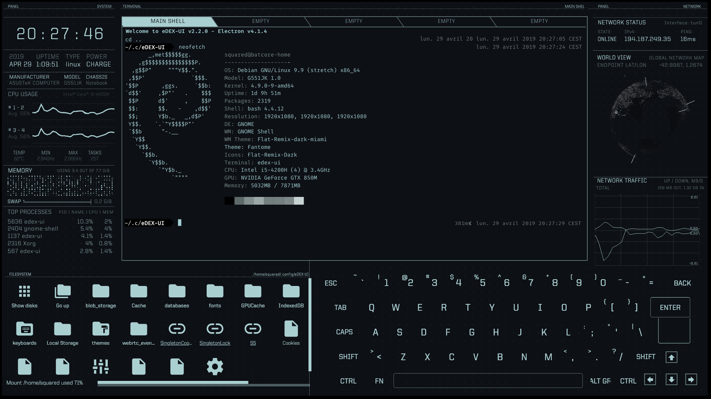

<div align="center">

# SekerEdexWebLab

**A browser-native eDEX-UI command deck that behaves like a system—not a screenshot.**

[Live demo](https://www.seker.wang) · [简体中文](README.zh-CN.md) · [Quick start](#quick-start) · [Experience](#what-you-can-do) · [Verification](#verification)

[](https://github.com/Seker800/SekerEdexWebLab/actions/workflows/ci.yml)
[](LICENSE)
[](package.json)
[](#project-status)

</div>



<p align="center"><sub>The browser implementation at its canonical 1920×1080 desktop viewport.</sub></p>

<p align="center"><strong><a href="https://www.seker.wang">Launch the live demo →</a></strong></p>

SekerEdexWebLab recreates the eDEX-UI 2.2 `tron` experience in the browser: a central terminal, live
telemetry, filesystem, globe, sound, and an on-screen keyboard all respond through one shared session.
The repository also contains the deterministic capture and comparison system used to prove that the
port still matches its frozen visual target.

> [!IMPORTANT]
> SekerEdexWebLab is an unofficial browser port derived from GitSquared's
> [eDEX-UI](https://github.com/GitSquared/edex-ui). It is not maintained or endorsed by GitSquared or
> the upstream contributors.

## Why this project

| Product experience | Engineering discipline |
| --- | --- |
| A full-screen command deck rather than a static terminal-themed page | Source-driven reconstruction from the screenshot-era eDEX-UI code |
| Terminal, files, content, telemetry, keyboard, motion, and sound share state | Immutable reference evidence and deterministic browser captures |
| Desktop fidelity with a deliberate mobile fallback | Regional pixel/perceptual budgets and executable acceptance gates |
| Mouse, physical keyboard, on-screen keyboard, and touch paths | Bounded repair attempts that cannot weaken the target or judge |

## What you can do

- Run the complete boot sequence with staged panels, original upstream cues, replay, and persistent
  sound controls.
- Use the terminal from a physical keyboard, the QWERTY screen keyboard, mouse, or touch, with visible
  feedback across the deck.
- Navigate the browser-safe filesystem and open repository-backed articles and image galleries from
  either terminal commands or direct manipulation.
- Watch the clock, process activity, CPU, memory, network traffic, and globe update without turning
  renderers into hidden application state.
- Use the fixed 1920×1080 desktop composition at any desktop viewport, or enter the explicit mobile
  fallback on smaller screens.
- Reproduce the canonical state, inspect regional differences, and generate durable evidence for each
  verification run.

## Quick start

Requires Node.js 22 and npm.

```bash
git clone https://github.com/Seker800/SekerEdexWebLab.git
cd SekerEdexWebLab
npm ci
npm run app:dev
```

Open the printed local URL and choose **Initialize system**. Use **REBOOT** to replay the startup
sequence and **SOUND ON/OFF** to control audio.

To install the browser engines and run the complete local acceptance gate:

```bash
npm run install:browsers
npm run verify
```

## How it works

```text
physical / screen / mouse / touch input
                    │
                    ▼
          typed commands and intents
                    │
                    ▼
        session controller + event bus
           ┌────────┼─────────┐
           ▼        ▼         ▼
       terminal  telemetry  content / files
           └────────┼─────────┘
                    ▼
           visual and audio feedback
```

React owns declarative UI state. Imperative systems—terminal rendering, globe, JPEG effects, audio,
and scheduled animation—sit behind disposable adapters. Browser observation, comparison, verdicts,
and optional source repair remain separate process boundaries; only executable gates decide whether a
scenario passes.

### Repository map

| Path | Responsibility |
| --- | --- |
| [`apps/clone`](apps/clone) | Browser application and copied-asset provenance |
| [`examples/blog`](examples/blog) | Repository-backed sample articles and media |
| [`src`](src) | Scenario configuration, capture orchestration, judging, and repair contracts |
| [`scripts`](scripts) | App, asset, gate, and replication verification entry points |
| [`specs`](specs) / [`schemas`](schemas) | Scenario contracts and typed process-boundary data |
| [`references`](references) | Pinned upstream source and frozen visual evidence |

Start with [NORTH_STAR.md](NORTH_STAR.md), [ARCHITECTURE.md](ARCHITECTURE.md), and the
[visual north star](docs/VISUAL_NORTH_STAR.md). The module-level upstream lookup table lives in
[docs/SOURCE_PORT_MAP.md](docs/SOURCE_PORT_MAP.md).

## Verification

`npm run verify` checks gate integrity, upstream asset hashes, types, tests, coverage, the production
build, the demo workflow, Chromium and WebKit behavior, regional visual budgets, and deterministic
replication.

| Command | Purpose |
| --- | --- |
| `npm run app:verify` | Startup, audio, interactions, layouts, and browser error gates in Chromium |
| `npm run app:verify:webkit` | Core interactions, canvas geometry, mobile fallback, and browser errors in WebKit |
| `npm run app:hotspots` | Rank the most visible 64×64 difference regions |
| `npm run assets:verify` | Check copied upstream assets against the SHA-256 manifest |
| `npm run replicate:verify` | Run the frozen visual replication state machine |
| `npm run replicate:repair` | Run up to three guarded, source-first repair attempts |

Reports and screenshots are written to `artifacts/` and intentionally excluded from releases.

## Project status

Version 0.1 is a Phase 0 feasibility build. The startup and sound sequence, core interaction paths,
desktop and mobile viewports, content browser, media viewer, and browser error gates are implemented
and covered by the repository's acceptance workflow.

The terminal and telemetry use explicit, browser-safe simulations; this is not a remote shell or real
host monitor. Authenticated sessions, route crawling, network contract comparison, and host telemetry
remain future extension points. The project does not claim to be a drop-in replacement for the
original desktop application.

## Source and provenance

The original application was created by [GitSquared](https://github.com/GitSquared) and released under
GPLv3. The canonical interface source for this port is commit
[`66ba190`](https://github.com/GitSquared/edex-ui/commit/66ba190ee5369523195c4012d0a798fbe4d43391),
immediately after the `v2.2.0` tag. The later
[`v2.2.8`](https://github.com/GitSquared/edex-ui/releases/tag/v2.2.8) release is a secondary code and
asset reference. The frozen target is documented in [the visual parity contract](docs/visual-parity.md).

See [NOTICE.md](NOTICE.md) for authorship and third-party credits, and
[apps/clone/UPSTREAM_ASSETS.md](apps/clone/UPSTREAM_ASSETS.md) for the file-level copied-asset inventory.

## Contributing

Issues and pull requests are welcome. Read [CONTRIBUTING.md](CONTRIBUTING.md) before changing the source;
this project requires provenance checks and deterministic visual gates in addition to ordinary tests.

## License

SekerEdexWebLab is distributed under the [GNU General Public License v3.0](LICENSE), matching the
original eDEX-UI project. Copyright in upstream code and assets remains with their respective authors.
