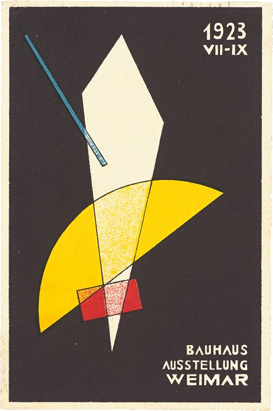

# A signal made from circles and lines

This postcard by László Moholy-Nagy is more than a period artifact. It behaves like a tiny interface: geometry establishes hierarchy, contrast directs attention, and every element appears to have a job.

## No decoration without structure

The composition is built from a deliberately small vocabulary. Circles interrupt rectangles. Diagonals create speed. Black areas hold the page together while the lighter forms make the eye change direction.

What feels expressive is actually highly constrained:

- few shapes;
- strong scale changes;
- asymmetric balance;
- repeated alignment;
- empty space used as an active element.

## The interface lesson

Reducing the number of visual ingredients does not make a system sterile. It makes relationships visible. A good operational screen can borrow that discipline: reserve brightness for state, let alignment explain grouping, and make exceptions expensive.

The result should not imitate Bauhaus styling. It should inherit the underlying economy.

Continue with [a botanical page where precision comes from observation](../field-notes-dianthus/index.md).

