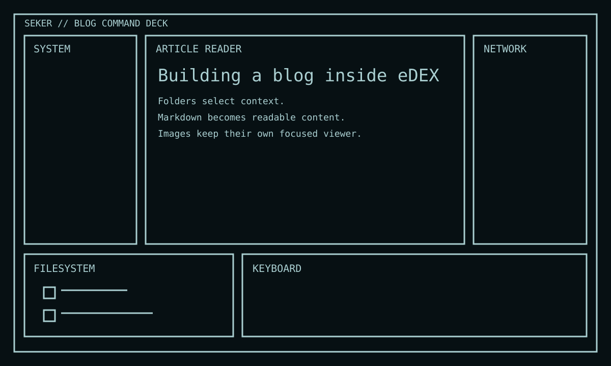
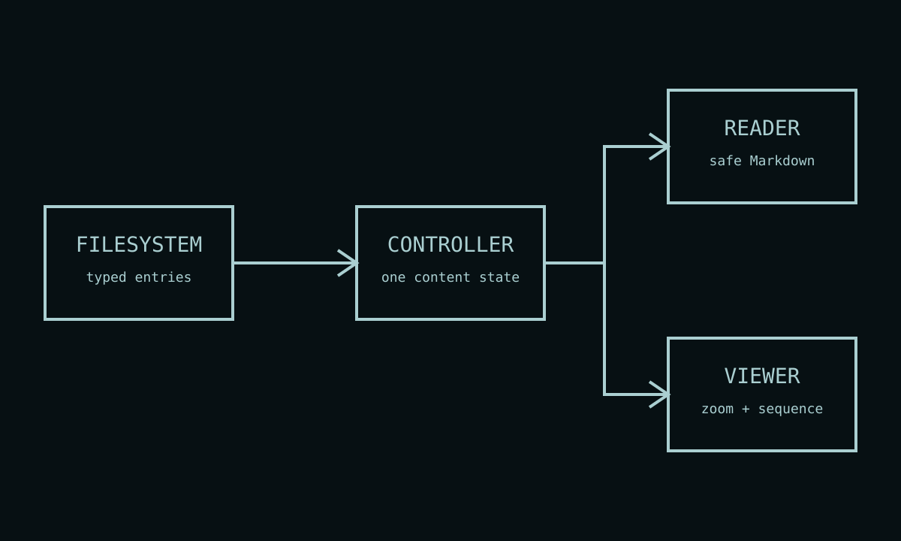

# Building a blog inside eDEX

The blog keeps the single screen command deck and gives each region a useful role.

## Content flow

1. The build creates a validated content manifest from ordinary Markdown files and media.
2. The filesystem projects that manifest into folders and typed previews.
3. The command deck controller owns the selected article.
4. The reader resolves safe Markdown links against the same content tree.
5. The image viewer owns zoom, directory-local sequence navigation, and dismissal.

This keeps content data separate from DOM rendering and from the virtual filesystem adapter.
