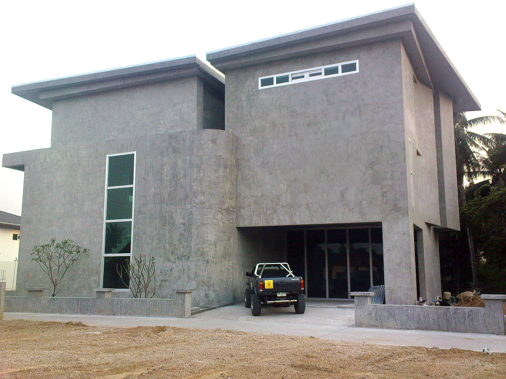

# Concrete is a lighting instrument

Brutalist buildings are often described through mass: heavy slabs, exposed structure, uncompromising surfaces. But mass is only half the story. The other half is the way that mass edits light.

## Shadow gives the volume its edge

At Wing House, the projecting planes do not simply shelter the interior. They create calibrated darkness. Deep shade makes the brighter openings feel sharper, while the concrete changes character as the sun moves across it.

Three details do most of the work:

- long horizontal projections stretch the building toward the landscape;
- recessed glass makes the structure read as a sequence of layers;
- unfinished concrete records weather, construction, and time instead of hiding them.

## A useful contradiction

The building feels both defensive and open. Its structure is visibly heavy, yet the framed gaps pull the eye through it. That contradiction is more interesting than the label “brutalism.” It turns a static material into an instrument for depth, temperature, and time.

Return to [the city at night](../night-routes/index.md) and notice how differently glass, rain, and artificial light construct space.

