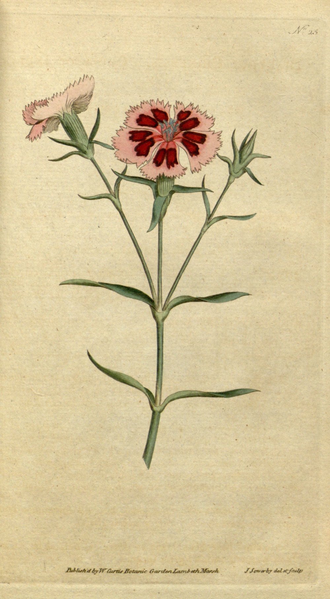

# Field notes on a printed flower

Before a botanical plate becomes data, it begins as attention. Someone has to notice how a stem divides, where a leaf folds, and which irregularity belongs to the specimen rather than the drawing hand.

## A page that rewards patience

The first glance gives us a flower. The second gives us a system: root, stem, node, leaf, bud, bloom. The empty paper is not an absence; it isolates each decision and lets the plant remain legible from base to petal.

Try reading it from the bottom upward:

1. the roots establish weight;
2. the stem carries the eye through the page;
3. paired leaves create a quiet cadence;
4. the flowers break that cadence with color and complexity.

## Archive as interface

A good archive does not merely store an object. It preserves enough context to make the object usable again: name, date, source, maker, and the conditions under which it may be shared.

That is why the image credit matters as much as the pixels. The plate is beautiful, but its provenance is what lets it travel safely into a new collection.

Next: [concrete, shadow, and another kind of restraint](../concrete-and-light/index.md).

