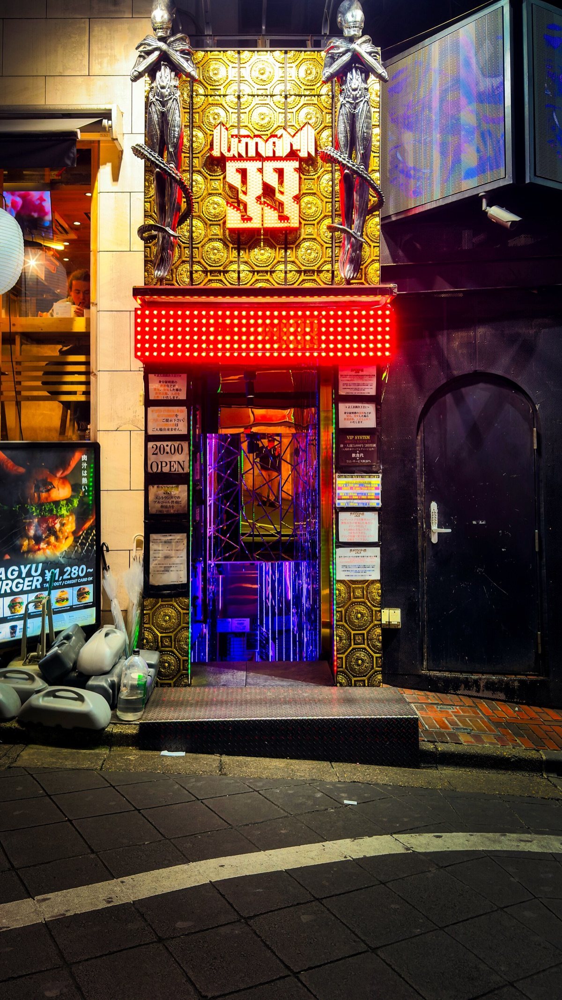

# Night routes, loud thresholds

Some cities become easier to read one doorway at a time. A side street turns into a sequence of thresholds: a restaurant window, a black service door, a staircase saturated with colored light.

## Walk without a destination

The useful rule is simple: do not optimize the route. Turn when the light changes. Stop when an entrance makes the street feel like a stage. Let the camera stay down until the scene has a rhythm of its own.

At night, distance is measured less by blocks than by transitions:

1. fluorescent white to saturated red;
2. ordinary cladding to ornamental metal;
3. a bright invitation to an almost invisible side door;
4. the public pavement to a staircase whose destination stays hidden.

## What the frame keeps

The photograph is dense, but the feeling is not. It keeps just enough evidence to reconstruct the walk while leaving the actual story open. That balance is what makes a city image worth returning to.

Next: [a very different way to organize a picture](../bauhaus-signal/index.md).
